# 继承、

## 继承的概念及定义

### 继承的概念

继承机制是面向对象程序设计使代码可以复用的最重要的手段，它允许程序员在保持原有类特性的基础上进行扩展，增加功能，这样产生的新类称为派生类。继承呈现了面向对象程序设计的层次结构，体现了由简单到复杂的认知过程。以前的复用都是函数复用，继承使类设计层次的复用。

```C++{.line-numbers}
class Person
{
public:
    void Print()
    {
        cout<<"name:"<<_name<<endl;
        cout<<"age:"<<_age<<endl;
    }
protected:
    string _name="peter";//姓名
    int _age=18;//年龄
};
//继承父类Person的成员(成员函数+成员变量)都会变成子类的一部分。这里体现出了Student和Teacher复用了Person的成员。
class Student:public Person
{
protected:
    int _stuid;//工号
};
class Teacher:public Person
{
    int _jobid;//工号
};
```

### 继承的定义

#### 定义格式

Person是父类，也称作基类。Student是子类，也称作派生类。



#### 继承关系和访问限定符



#### 继承基类成员访问方式的变化

|类成员/继承方式|public继承|protected继承|private继承|
|-|-|-|-|
|基类的public成员|派生类的public成员|派生类的protected成员|派生类的private成员|
|基类的protected成员|派生类的protected成员|派生类的protected成员|派生类的private成员|
|基类的private成员|在派生类中不可见|在派生类中不可见|在派生类中不可见|

**总结**

1. 基类private成员在派生类中无论以什么方式继承都是不可见的。这里的不可见是指基类的私有成员还是被继承到了派生对象中，但是语法上限制派生类对象不管在类里面还是类外面都不能去访问它。
2. 基类private成员在派生类中是不能被访问，如果基类成员不想在类外直接被访问，但需要在派生类中能访问，就定义为protected。可以看出保护成员限定符是因继承才出现的。
3. 基类的私有成员在子类中都是不可见的。基类的其它成员在子类的访问方式为成员在基类的访问限定符与继承方式中访问权限最小的访问方式，$public>protected>private$。
4. 使用关键字class时默认的继承方式是private，使用struct时默认的继承方式是public，最好显式地写出继承方式。
5. 在实际运用中一般使用都是public继承，几乎很少使用protected/private继承，也不提倡使用protected/private继承，因为protected/private继承下来的成员都只能在派生类的类里使用，实际中扩展维护性不强。

## 基类和派生类对象赋值转换

* 派生类对象可以赋值给基类的对象/基类的指针/基类的引用。这里有个形象的说法叫切片或者切割。寓意把派生类中父类哪部分切割来赋值过去。
* 基类对象不能赋值给派生类对象。
* 基类的指针可以通过强制类型转换赋值给派生类的指针。但是必须是基类的指针式指向派生类对象时才是安全的。这里基类如果是多态类型，可以使用RTTI(Run-Time Type Information)的dynamic cast来进行识别后进行安全转换。 



```C++{.line-numbers}
class Person
{
protected:
    string _name;
    string _sex;
    int _age;
};
class Student:public Person
{
public:
    int _No;
};
void Test()
{
    Student sobj;
    //父类和子类赋值兼容原则
    //1.派生类对象可以赋值给基类对象/指针/引用
    Person pobj=sobj;
    Person* pp=&sobj;
    Person& rp=sobj;
    //2.基类对象不能赋值给派生类对象
    sobj=pobj;//error
    //3.基类的指针可以通过强制类型转换赋值给派生类的指针

    pp=&sobj;//基类指针指向派生类地址
    Student* ps1=(Student*)pp;//这种情况转换时是可以的
    ps1->_No=10;

    pp=&pobj;//基类指针指向基类地址
    Student* ps2=(Student*)pp;//这种情况转换虽然可以，但是会存在越界访问的问题
    ps2->_No=10;
}
```

## 继承中的作用域

1. 在继承体系中基类和派生类都有独立的作用域。
2. 子类和父类中有同名成员，子类成员将屏蔽父类对同名成员的直接访问，这种情况叫隐蔽，也叫重定义。
    (在子类成员函数中，可以使用 基类::基类成员 显示访问)
3. 需要注意的是如果是成员函数的隐藏，只需要函数名相同就构成隐藏。
4. 注意在实际的继承体系里面最好不要定义同名成员。

```C++{.line-numbers}
//Student的_num和Person的_num构成隐藏关系，可以看出这样代码虽然能运行，但是非常容易混淆
class Person
{
protected:
    string _name="小李子";//姓名
    int _num=111;//身份证号
};
class Student:public Person
{
public:
    void Print()
    {
        cout<<"姓名："<<_name<<endl;
        cout<<"身份证号："<<Person::_num<<endl;
        cout<<"学号："<<_num<<endl;
    }
protected:
    int _num=999;//学号
};
```

## 派生类的默认成员函数



1. 派生类的构造函数必须调用基类的构造函数初始化基类的那一部分成员。如果基类没有默认的构造函数，则必须在派生类构造函数的初始化列表阶段显示调用。
2. 派生类的拷贝构造函数必须调用基类的拷贝构造完成基类的拷贝初始化。
3. 派生类的operator=必须要调用基类的operator=完成基类的赋值。
4. 派生类的析构函数会在被调用完成后自动调用基类的析构函数清理基类成员。因为这样才能保证派生类对象先清理派生类成员再清理基类成员的顺序。
5. 派生类对象初始化先调用基类构造，再调用派生类构造。
6. 派生类对象析构清理先调用派生类析构，再调用基类析构。
