# 多态

- [多态](#多态)
  - [多态的概念](#多态的概念)
  - [多态定义及实现](#多态定义及实现)
    - [多态的构成条件](#多态的构成条件)
    - [虚函数](#虚函数)
    - [虚函数的重写](#虚函数的重写)
    - [重载、覆盖(重写)、隐藏(重定义)的对比](#重载覆盖重写隐藏重定义的对比)
  - [抽象类](#抽象类)
    - [概念](#概念)
    - [接口继承和实现继承](#接口继承和实现继承)
  - [多态的原理](#多态的原理)
    - [虚函数表](#虚函数表)
    - [动态绑定与静态绑定](#动态绑定与静态绑定)
  - [单继承和多继承关系的虚函数表](#单继承和多继承关系的虚函数表)
    - [单继承中的虚函数表](#单继承中的虚函数表)

## 多态的概念

多态通俗来说，就是多种形态。当类之间存在层次结构，并且类之间时通过继承关联时，就会用到多态。
C++多态意味着调用成员函数时，会根据调用函数的对象的类型来执行不同的函数。

## 多态定义及实现

### 多态的构成条件

多态是在不同继承关系的类对象，去调用同一函数，产生了不同的行为。比如Student继承了Person。
Person对象买票全价，Student对象买票半价。

那么在继承中要构成多态还有两个条件：

1. 必须通过**基类**的**指针**或者**引用**调用虚函数
2. 被调用的函数必须是虚函数，且派生类必须对基类的虚函数进行重写



### 虚函数

被virtual修饰的类成员函数称为虚函数。

```C++{.line-numbers}
class Person
{
public:
    virtual void BuyTicker()
    {
        cout<<"买票全价"<<endl;
    }
};
```

### 虚函数的重写

虚函数的重写(覆盖)：派生类中有一个跟基类完全相同的虚函数(即派生类虚函数与基类虚函数的返回值类型、函数名字、参数列表完全相同)，称子类的虚函数重写了基类的虚函数。

```C++{.line-numbers}
class Person
{
public:
    virtual void BuyTicket()
    {
        cout<<"买票全价"<<endl;
    }
};
class Student:public Person
{
public:
    virtual void BuyTicket()
    {
        cout<<"买票半价"<<endl;
    }
}; 
/*
注意：在重写基类虚函数时，派生类的虚函数在不加virtual关键字时，虽然也可以构成重写(因为继承后，基类的虚函数被继承下来了，在派生类依旧保持虚函数属性)，但是这种写法不是很规范，不建议这样使用
*/
void Func(Person& p)
{
    p.BuyTicket();
}
int main()
{
    Person ps;
    Student st;
    Func(ps);
    Func(st);
    return 0;
}
```
**虚函数重写的两个例外**

1. **协变(基类与派生类虚函数返回值类型不同)**
   派生类重写基类虚函数时，与基类虚函数返回值类型不同。即基类虚函数返回基类对象的指针或者引用，派生类虚函数返回派生类对象的指针或者引用时，称为协变。
   
   ```C++{.line-numbers}
   class A{};
   class B:public A{};
   class Person
   {
   public:
      virtual A* f(){return new A;}
   };
   class Student:public Person
   {
   public:
      virtual B* f(){return new B;}
   };
   ```

2. **析构函数的重写(基类与派生类析构函数的名字不同)**
   如果基类的析构函数为虚函数，此时派生类析构函数只要定义，无论是否加virtual关键字，都与基类的析构函数构成重写，虽然基类与派生类析构函数名字不同。虽然函数名不相同，看起来违背了重写的规则，其实不然，这里可以理解为编译器对析构函数的名称做了特殊处理，编译后析构函数的名称统一处理成destructor。
   ```C++{.line-numbers}
   class Person
   {
   public:
        virtual ~Person(){cout<<"~Person()"<<endl;}
        //析构函数的函数名会被处理成destructor
   };
   class Student:public Person
   {
   public:
        virtual ~Student(){cout<<"~Student()"<<endl;}
        //析构函数的函数名会被处理成destructor
    };
    //只要派生类Student的析构函数重写了Person的析构函数，下面的delete对象调用析构函数，才能构成多态，才能保证p1和p2指向的对象正确地调用析构函数
    int main()
    {
        Person* p1=new Person;
        Person* p2=new Student;
        delete p1;
        delete p2;
        return 0;
    }
    ```

    ```C++{.line-numbers}
    class Person
    {
    public:
        ~Person(){cout<<"~Person()"<<endl;}
    };
    class Student:public Person
    {
    public:
        ~Student(){cout<<"~Student()"<<endl;}
    };
    int main()
    {
        Person* p1=new Person;
        Person* p2=new Student;//若不构成多态，调用的指针类型是谁就调用谁的析构函数
        delete p1;
        delete p2;
        //若基类析构函数不是虚函数，则此处派生类对象会调用基类的析构函数
        //如果Student析构函数中有资源释放，而没有调用，却调用Person析构函数，则会发生内存泄漏
        return 0;
    }
    ```

### override和final

从上面可以看出，C++对函数重写的要求比较严格，但是有些情况下由于疏忽，可能会导致函数名字母次序写反而无法构成重载，而这种错误在编译期间是不会报出的，只有在程序运行时没有得到预期结构才来debug会得不偿失，因此C++11提供了override和final两个关键字，可以帮助用户检测是否重写。

1. **final：修饰虚函数，表示该虚函数不能再被继承**
   
   ```C++{.line-numbers}
   class Car
   {
   public:
      virtual void Drive()final{} 
   };
   class Benz:public Car
   {
   public:
      virtual void Drive(){} 
   };
   ```

2. **override：检查派生类虚函数是否重写了基类某个虚函数，如果没有重写编译报错**

   ```C++{.line-numbers}
   class Car
   {
   public:
      virtual void Drive(){} 
   };
   class Benz:public Car
   {
   public:
      virtual void Drive()override{} 
   };
   ```

### 重载、覆盖(重写)、隐藏(重定义)的对比



## 抽象类

### 概念

在虚函数的后面写上=0，则这个函数为纯虚函数。包含纯虚函数的类叫作抽象类(也叫接口类)，**抽象类不能实例化出对象**。**派生类继承后也不能实例化出对象**，只有重写纯虚函数，派生类才能实例化出对象。纯虚函数规范了派生类必须重写，另外纯虚函数更体现出了接口继承。

```C++{.line-numbers}
class Car//抽象类
{
public:
    virtual void Drive()=0;//不需要实现，纯虚函数
};
class Benz:public Car
{
public:
    virtual void Drive(){}//必须对纯虚函数重写
};
class BMW:public Car
{
public:
    virtual void Drive(){}
};
```

### 接口继承和实现继承

普通函数的继承是一种实现继承，派生类继承了基类函数，可以使用函数，继承的是函数的实现。虚函数的继承是一种接口继承，派生类继承的是基类虚函数的接口，目的是为了重写，达成多态，继承的是接口。所以如果不实现多态，不要把函数定义成虚函数。

## 多态的原理

### 虚函数表

```C++{.line-numbers}
//sizeof(Base)是多少？
class Base
{
public:
    virtual void Func1()
    {
        cout<<"Func1()"<<endl;
    }
private:
    int _b=1;
};
```

通过观察测试我们发现b对象是8bytes(x32)，除了_b成员，还多了一个__vfptr放在对象的前面(注意有些平台可能会放到对象的后面)，对象中的这个指针我们叫作虚函数表指针(v代表virtual，f代表function)。一个含有虚函数的类中都至少有一个虚函数表指针，因为虚函数的地址要被放到虚函数表中，虚函数表也简称虚表。
虚函数表指针是一个指针数组。
多态是在运行时到指向的对象的虚表中查找要调用的虚函数的地址来进行调用。
普通函数和虚函数都会被编译成指令以后存在代码段。

```C++{.line-numbers}
class Base
{
public:
    virtual void Func1()
    {
        cout<<"Base::Func1()"<<endl;
    }
    virtual void Func2()
    {
        cout<<"Base::Func2()"<<endl;
    }
    void Func3()
    {
        cout<<"Base::Func3()"<<endl;
    }
private:
    int _b=1;
};
//Base中虚函数表__vfptr存放着Base::Func1与Base::Func2
class Derive:public Base
{
public:
    virtual void Func1()//只重写Func1
    {
        cout<<"Derive::Func1()"<<endl;
    }
private:
    int _d=2;
};
//Derive中虚函数表__vfptr存放着Derive::Func1与Base::func2
//可见派生类继承了基类的虚函数表，并对重写虚函数的指针进行覆盖
int main()
{
    Base b;
    Derive d;
    return 0;
}
```

通过观察和测试，我们发现了以下几点问题：
1. 派生类对象d中也有一个虚表指针，d对象由两部分构成，一部分是父类继承下来的成员，虚表指针也就是存在部分的另一部分是自己的成员。
2. 基类b对象和派生类d对象虚表是不一样的，这里我们发现Func1完成了重写，所以d的虚表中存的是重写的Derive::Func1，所以虚函数的重写也叫作覆盖，覆盖就是指虚表中虚函数的覆盖。重写是语法的叫法，覆盖是原理层的叫法。
3. 另外Func2继承下来后是虚函数，所以放进了虚表，Func3也继承下来了，但是不是虚函数，所以不会放进虚表。
4. 虚函数表本质是一个存虚函数指针的指针数组，这个数组最后面放了一个nullptr。
5. 总结一下派生类的虚表生成：
   * 先将基类中的虚表内容拷贝一份到派生类虚表中
   * 如果派生类重写了基类中某个虚函数，用派生类自己的虚函数覆盖虚表中基类的虚函数
   * 派生类自己新增加的虚函数按其在派生类中的声明次序增加到派生类虚表的最后
6. 虚表存的是虚函数指针，不是虚函数，虚函数和普通函数一样，都存在代码段，只是它的指针又存到了虚表中。另外对象中存的不是虚表，存的是虚表指针。

### 动态绑定与静态绑定

1. 静态绑定又称为前期绑定(早绑定)，在程序编译期间确定了程序员的行为，也称为静多态，比如：函数重载
2. 动态绑定又称为后期绑定(晚绑定)，在程序运行期间，根据具体拿到的类型确定程序的具体行为，调用具体的函数，也称为动态多态

## 单继承和多继承关系的虚函数表

### 单继承中的虚函数表

```C++{.line-numbers}
class Base
{
public:
    virtual void func1(){cout<<"Base::func1"<<endl;}
    virtual void func2(){cout<<"Base::func2"<<endl;}
private:
    int a;
};
class Derive:public Base
{
public:
    virtual void func1(){cout<<"Deruve::func1"<<endl;}
    virtual void func3(){cout<<"Derive::func3"<<endl;}
    virtual void func4(){cout<<"Derive::func4"<<endl;}
private:
    int b;
};
typedef void(*VF_PTR)();//函数指针类型typedef
void PrintVFTable(VF_PTR* pTable)
{
    for(size_t i=0;i<pTable[i]!=0;++i)
    {
        printf("vfTable[%d]:%p\n",i,pTable[i]);
        VF_PTR f=pTable[i];
        f();
    }
    cout<<endl;
}
int main()
{
    Base b;
    Derive d;
    PrintVFTable((VF_PTR*)(*(int*)&b));
    PrintVFTable((VF_PTR*)(*(int*)&d));
    return 0;
}
```