# vector

- [vector](#vector)
  - [vector的介绍及使用](#vector的介绍及使用)
    - [vector的介绍](#vector的介绍)
    - [vector的使用](#vector的使用)
      - [vector的定义](#vector的定义)
      - [vector iterator的使用](#vector-iterator的使用)
      - [vector空间增长问题](#vector空间增长问题)
      - [vector迭代器失效问题](#vector迭代器失效问题)
  - [vector深度剖析及模拟实现](#vector深度剖析及模拟实现)
    - [std::vector的核心框架接口的模拟实现](#stdvector的核心框架接口的模拟实现)

## vector的介绍及使用

### vector的介绍

1. vector是表示可变大小数组的序列容器。
2. 就像数组一样，vector也采用连续存储空间来存储元素。也就是意味着可以采用下标对vector的元素进行访问，和数组一样高效。但是又不像数组，它的大小是可以动态改变的，而且它的大小会被容器自动处理。
3. 本质讲，vector使用动态分配数组来存储它的元素。当新元素插入的时候，为了增加存储空间，这个数组需要被重新分配大小。其做法是分配一个新的数组，然后将全部元素移到这个数组。就时间而言，这是一个相对代价高的任务，因为每当一个新的元素加入到容器的时候，vector并不会每次都重新分配大小。
4. vector分配空间策略：vector会分配一些额外的空间以适应可能的增长，因为存储空间比实际需要的存储空间更大。不同的库采用不同的策略权衡空间的使用和重新分配。但是无论如何，重新分配都应该是对数增长的间隔大小，以至于在末尾插入一个元素的时候是在常数时间的复杂度完成的。
5. 因此，vector占用了更多的存储空间，为了获得管理存储空间的能力，并且以一种有效的方式动态增长。
6. 与其它动态序列容器相比(deques,lists and forward_lists)，vector在访问元素的时候更加高效，在末尾添加和删除元素相对高效。对于其它不在末尾的删除和插入操作，效率更低。比起lists和forward_lists统一的迭代器和引用更好。

### vector的使用

#### vector的定义

|(constructor)构造函数声明|接口声明|
|-|-|
|vector()(重点)|无参构造|
|vector(size_type n,const value_type& val=value_type())|构造并初始化n个val|
|vector(const vector& x)(重点)|拷贝构造|
|vector(InputIterator first,InputIterator last)|使用迭代器进行初始化构造|

```C++{.line-numbers}
//constructing vectors
#include<iostream>
#include<vector>
int main()
{
    //constructors used in the same order as described above;
    std::vector<int> first;//empty vector of ints
    std::vector<int> second(4,100);//four ints with value 100
    std::vector<int>third(second.begin(),second.end());//iterating through second
    std::vector<int>fourth(third);//a copy of third
    //the iterator constructor can also be used to construct from arrays;
    int myints[]={16,2,77,29};
    std::vector<int>fifth(myints,myints+sizeof(myints)/sizeof(int));
    std::cout<<"The contents of fifth are:";
    for(std::vector<int>::iterator it=fifth.begin();it!=fifth.end();++it)
    {
        std::cout<<' '<<*it;
    }
    std::cout<<'\n';
    return 0;
}
```

#### vector iterator的使用

|iterator的使用|接口说明|
|-|-|
|begin+end(重点)|获取第一个数据位置的iterator/const_iterator，获取最后一个数据的下一个位置的iterator/const_iterator|
|rbegin+rend|获取最后一个数据位置的reverse_iterator，获取第一个数据前一个位置的reverse_iterator|

```C++{.line-numbers}
#include<iostream>
#include<vector>
using namespace std;
int main()
{   vector<int> s;//无参构造
    vector<int> s1(4,100);//构造并初始化4个100
    //vector<int> s2(s1.begin(),s1.end());//使用迭代器进行初始化构造
    //vector<int> s3(s1);//拷贝构造
    //cinst对象使用const迭代器进行遍历打印
    s1.push_back(1);
    s1.push_back(2);
    s1.push_back(3);
    s1.push_back(4);
    //使用迭代器进行遍历打印
    vector<int>::iterator it=s1.begin();//普通正向迭代器，可读可写
    while(it!=s1.end())
    {
        cout<<*it<<" ";
        ++it;
    }
    cout<<endl;
    vector<int>::const_iterator cit=s1.begin();//const正向迭代器，只读
    while(cit!=s1.end())
    {
        //*cit=1;错误
        cout<<*cit<<" ";
        ++cit;
    }
    //反向迭代器进行遍历打印
    vector<int>::reverse_iterator rit=s1.begin();//reverse逆置
    while(rit!=s1.rend())
    {
        cout<<*rit<<" ";
        ++rit;
    }
    cout<<endl;
    //范围for进行遍历打印->被编译器替换成迭代器方式遍历
    for(auto e:v)
    {
        cout<<e<<" ";
    }
    cout<<endl;
    return 0;
}
```

#### vector空间增长问题

|容量空间|接口说明|
|-|-|
|size|获取数据个数|
|capacity|获取容量大小|
|empty|判断是否为空|
|resize(重点)|改变vector的size|
|reserve(重点)|改变vector放入capacity|

* capacity的代码在vs和g++下分别运行会发现，vs下capacity是按1.5倍增长的，g++是按2倍增长的。这个问题经常会考察，不要固化地认为，顺序表增容都是2倍，具体增长多少是根据具体的需求定义的。vs是PJ版本STL，g++是SGI版本STL。
* reserve只负责开辟空间，如果确定知道需要用多少空间，reserve可以缓解vector增容的代价缺陷问题。
* resize在开辟空间的同时还会进行初始化，影响size。

```C++{.line-numbers}
//vector::capacity
#include<iostream>
#include<vector>
int main()
{
    size_t sz;
    std::vector<int> foo;
    sz=foo.capacity();
    std::cout<<"making foo grow:\n";
    for(int i=0;i<100;++i)
    {
        foo.push_back(i);
        if(sz!=foo.capacity())
        {
            sz=foo.capacity();
            std::cout<<"capacity changed:"<<sz<<'\n';
        }
    }
}
```

> vs运行结果:  
> making foo grow:  
> capacity changed:1  
> capacity changed:2  
> capacity changed:3  
> capacity changed:4  
> capacity changed:6  
> capacity changed:9  
> capacity changed:13  
> capacity changed:19  
> capacity changed:28  
> capacity changed:42  
> capacity changed:63  
> capacity changed:94  
> capacity changed:141  
>  
> g++运行结果:  
> making foo grow:  
> capacity changed:1  
> capacity changed:2  
> capacity changed:4  
> capacity changed:8  
> capacity changed:16  
> capacity changed:32  
> capacity changed:64  
> capacity changed:128  

增容相同空间，vs增容次数更多，效率更低，空间浪费小，g++增容次数更少，效率更高，空间浪费大。

```C++{.line-numbers}
#include<iostream>
#include<vector>
#include<algorithm>
using namespace std;
int main()
{
    vector<int> s;
    s.reserve(10);//把s的空间扩至10
    s.resize(10);//把s的有效位扩至10，空位用0代替，若空间不够，会先自动扩容
    s.resize(20,5)//把s的有效位扩至20，空位用5代替
    //at()函数
    vector<int> v;
    v.push_back(1);
    v.push_back(2);
    v.push_back(3);
    v.push_back(4);
    v[4]=5;//错误，程序中断运行
    v.at(4)=5;//错误，at函数会检测是否访问越界
    //at函数与[]的区别是，at函数会检测访问是否越界
    //[]效率更高
    v.insert(v.begin(),0);
    v.erase(v.begin());
    //find函数
    //find函数存在于算法中，其头文件为algorithm
    //使用find函数查找3所在位置的iterator
    vector<int>::iterator pos1=find(v.begin(),v.end(),3);
    //在pos位置之前插入44
    v.insert(pos,44);
    //找到3的位置，删除之前插入的44
    vector<int>::iterator pos2=find(v.begin(),v.end(),3);
    if(pos2!=v.end())//若未找到，会返回end()
    {
        v.erase(pos2-1);
    }
    return 0;
}
```

#### vector迭代器失效问题

```C++{.line-numbers}
#include<iostream>
#include<vector>
using namespace std;
int main()
{
    vector<int> v;
    v.push_back(1);
    v.push_back(2);
    v.push_back(3);
    v.push_back(4);
    //使用find查找3所在位置的iterator
    vector<int>::iterator pos=find(v.begin(),v.end(),3);
    //在pos位置之前插入44
    v.insert(pos,44);
    //删除插入的44
    v.erase(pos-1);//错误
}
```

**说明**

v.insert(pos,44);在插入时会因为空间不够而增容，增容之后pos会失效，之后的v.erase(pos-1);操作会出错，程序崩溃。

迭代器的主要作用就是让算法能够不用关心底层数据结构，其底层实际是一个指针，或者对指针进行了封装。

比如：vector的迭代器就是原生态指针T。因此迭代器失效，实际就是迭代器底层对应指针所指向的空间被销毁了，而使用一块已经被释放的空间，造成的后果是程序崩溃。

**对于vector可能会导致其迭代器失效的操作有**

会引起底层空间改变的操作都有可能使迭代器失效，比如：resize、reserve、insert、assign、push_back等。

```C++{.line-numbers}
#include<iostream>
#include<vector>
using namespace std;
int main()
{
    vector<int> v{1,2,3,4,5,6};
    auto it=v.begin();
    //将有效元素个数增加到100个，多出的位置使用8填充，操作期间底层会扩容
    //v.resize(100,8);
    //reserve的作用是改变容量大小但不改变有效元素个数，操作期间可能会引起底层容量改变
    //v.reserve(100);
    //插入元素期间，可能会引起扩容，而导致原空间被释放
    //v.insert(v.begin(),0);
    //v.push_back(8);
    //给vector重新赋值，可能会引起底层容量改变
    v.assign(100,8);
    while(it!=v.end())
    {
        cout<<*it<<" ";
        ++it;
    }
    cout<<endl;
    return 0;
}
```

**说明**

以上操作都有可能会导致vector扩容，也就是说vector旧空间被释放掉，而在打印时，it还使用释放之前的旧空间，在对it迭代器操作时，实际操作的是一块已经被释放的空间，而引起代码运行时的崩溃。

解决方法：在以上操作完成之后，如果想继续通过迭代器操作vector中的元素，只需给it重新赋值即可。

```C++{.line-numbers}
#include<iostream>
#include<vector>
using namespace std;
int main()
{
    int a[]={1,2,3,4};
    vector<int> v(a,a+sizeof(a)/sizeof(int));
    //使用find查找3所在位置的iterator
    vector<int>::iterator pos=find(v.begin(),v.end(),3);
    //删除pos位置的数据，导致pos迭代器失效
    v.erase(pos);
    cout<<*pos<<endl;//此处会导致非法访问
    return 0;
}
```

erase删除pos位置元素后，pos位置之后的元素会往前推移，没有导致底层空间的改变，理论上讲迭代器不应该会失效，但是，如果pos刚好是最后一个元素，删完之后pos刚好是end的位置，而end位置是没有元素的，那么pos就失效了。因此删除vector中任意位置上的元素时，vs就认为该位置迭代器失效了。

> 删除vector中所有的偶数  
> 
> ```C++{.line-numbers}
> #include<iostream>
> #include<vector>
> using namespace std;
> int main()
> {
>     vector<int> v{1,2,3,4};
>     auto it=v.begin();
>     while(it!=v.end())
>     {
>         if(*it%2==0)
>             it=v.erase(it);
>         else
>             ++it;
>     }        
>     return 0;     
> }
> ```
>
> 删除it之后，it就失效了。
> vs下会编译器会进行检查。
> gcc下没有严格的检查，可能会报错，可能会正常运行，也可能有个别偶数没被删除。
> 总结：不管哪个平台下，erase(it)后，it就失效了，只是导致的结果不一样。

## vector深度剖析及模拟实现




### std::vector的核心框架接口的模拟实现

这里的模拟实现不是把源码中的内容都搬下来，做个一模一样的东西，也不是造一个更好的轮子。模拟实现的目的是为了学习源码中的一些细节及核心框架。

> vector.h

```C++{.line-numbers}
#pragma once
namespace bit
{
    template<class T>
    class vector
    {
    public:
        typedef T* iterator;
        typedef const T* const_iterator;
        iterator begin()
        {
            return _start;
        }
        const_iterator begin() const
        {
            return _start;
        }
        iterator end()
        {
            return _finish;
        }
        const_iterator end() const
        {
            return _finish;
        }
        vector()
        :_start(nullptr)
        ,_finish(nullptr)
        ,_endofstorage(nullptr)
        {}
        //类模板的成员函数还可以再定义模板参数，这样写的好处是first/last可以是list等其它容器的迭代器，只要它解引用后的类型与T匹配
        template<class InputIterator>
        vector(InputIterator first,InputIterator last)
        :_start(nullptr)
        ,_finish(nullptr)
        ,_endofstorage(nullptr)
        {
            //这个构造函数里传的是一段迭代器区间，只有对象才知道有多少个容量
            while(first!=last)
            {
                push_back(*first);
                ++first;
            }
        }
        //v2(v1)
        //1.传统写法
        /*
        vector(const vector<T>& v)
        {
            _start=new T[v.capacity()];
            memcpy(_start,v._start,sizeof(T)*v.size());
            _finish=_start+v.size();
            _endofstorage=_start+v.capacity();
        }
        */
        //2.传统写法
        //复用当前的一些接口，本质还是自己开空间，这里相对于现代写法更推荐第二种传统写法
        /*
        vector(const vector<T>& v)
        :_start(nullptr)
        ,_finish(nullptr)
        ,_endofstorage(nullptr)
        {
            reserve(v.capacity());//一次性开辟好空间
            for(const auto& e:v)//引用的目的是防止T是string等类型
            {
                push_back(e);
            }
        }
        */
        //3.现代写法
        //vector的构造函数里还提供了一个显示的迭代器(它可以传其它容器或原生指针做迭代器，但是原生指针必须要求指向的空间是连续的)
        //所以这里还需要构造一个函数，这里的传统写法对比上面的传统写法并没有优势
        vector(const vector<T>& v)
        :_start(nullptr)
        ,_finish(nullptr)
        ,_endofstorage(nullptr)
        {
            //现代写法里提前开空间没有意义，因为现代写法的空间是tmp去做的
            //tmp没办法自己开辟空间,因为它不知道有多少个数据
            vector<T> tmp(v.begin(),v.end());
            swap(tmp);
        }
        void swap(vector<T>& v)
        {
            std::swap(_start,v._start);
            std::swap(_finish,v._finish);
            std::swap(_endofstorage,v._endofstorage);
        }
        //v1=v4
        //1.传统写法
        //任何容器的深拷贝都推荐现代写法，尤其是赋值操作
        /*
        vector<T>& operator=(const vector<T>& v)
        {
            if(this!=&v)
            {
                delete[]_start;
                _start=_finish=_endofstorage=nullptr;
                reserve(v.capacity());
                for(const auto& e:v)
                {
                    push_back(e);
                }
            }
            return *this;
        }
        */
        //2.现代写法
        vector<T>& operator=(vector<T> v)
        {
            //v与v1交换
            swap(v);
            return *this;
        }
        ~vector()
        {
            delete[]_start;
            _start=_finish=_endofstorage=nullptr;
        }
        size_t size() const
        {
            return _finish-_start;
        }
        size_t capacity() const
        {
            return _endofstorage-_start;
        }
        T& operator[](size_t i)
        {
            assert(i<size());
            return _start[i];
        }
        const T& operator[](size_t i) const
        {
            assert(i<size());
            return _start[i];
        }
        void reserve(size_t n)
        {
            if(n>capacity())
            {
                //备份一份
                size_t sz=size();
                T* tmp=new T[n];
                if(_start)
                {
                    //对于string，memcpy会引发更深层次的浅拷贝问题
                    //memcpy(tmp,_start,sizeof(T)*size());
                    for(size_t i=0;i<size();++i)
                    {
                        //如果T是string，它会调用string的operator=完成拷贝
                        tmp[i]=_start[i];
                    }
                    delete[]_start;
                }
                _start=tmp;
                _finish=_start+sz;
                //_finish=_start+size();错误,size去计算时，_finish还是旧空间的_finish，而_start却是新空间的_start
                _endofstorage=_start+n;
            }
        }
        void resize(size_t n,const T& val=T())
        {
            if(n<=size())
            {
                _finish=_start+n;
            }
            else
            {
                if(n>capacity())
                {
                    reserve(n);
                }
                while(_finish<_start+n)
                {
                    *_finish=val;
                    ++_finish;
                }
            }
        }
        void push_back(const T& x)
        {
            /*
            if(_finish==_endofstorage)
            {
                size_t newcapacity=capacity()==0?4:capacity()*2;
                reserve(newcapacity);
            }
            //这里不用像源码中一样使用定位new，因为使用定位new的原因时finish指向的空间没有初始化，所以使用定位new来构造对象
            *_finish=x;
            ++_finish;
            */
            insert(end(),x);
        }
        void pop_back()
        {
            /*
            //一般情况下，--_f_inish就行了，但是特殊情况vector为空时就不好了
            //所以一般需要assert
            assert(!empty());
            --_finish;
            */
            erase(--end());
        }
        iterator insert(iterator pos,const T& x)
        {
            //可以=_finish，相当于尾插
            assert(pos>=_start&&pos<=_finish);
            if(_finish==_endofstorage)
            {
                size_t len=pos-_start;
                size_t newcapacity+capacity()==0?4:capacity()*2;
                //reserve里会更新三个成员变量，insert返回插入的元素地址
                reserve(newcapacity);
                pos=_start+len;
            }
            iterator end=_finish-1;
            while(end>=pos)
            {
                *(end+1)=*end;
                --end;
            }
            *pos=x;
            ++_finish;
            return pos;
        }
        iterator erase(iterator pos)
        {
            assert(pos>=_start&&pos<_finish);
            iterator it=pos+1;
            while(it!=_finish)
            {
                *(it-1)=*it;
                ++it;
            }
            --_finish;
            return pos;
        }
    private:
    iterator _start;
    iterator _finish;
    iterator _endofstorage;
    };
    void print(const vector<int>& v)//const版本的迭代器和operator[]
    {
        vector<int>::const_iterator it=v.begin();
        while(it!=v.end())
        {
            cout<<*it<<" ";
            ++it;
        }
        cout<<endl;
        for(auto e:v)
        {
            cout<<e<<" ";
        }
        cout<<endl;
        for(size_t i=0;i<v.size();++i)
        {
            cout<<v[i]<<" ";
        }
        cout<<endl;
    }
}
```
